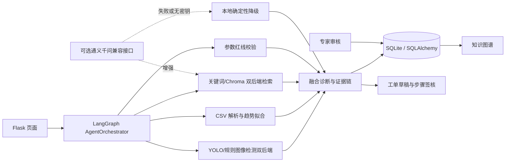

# 系统架构

## 数据流

## 关键设计

1. **全站会话保护**：单账号配置由 `ADMIN_USERNAME` 与 `ADMIN_PASSWORD_HASH` 提供，业务页面和 API 需要登录；`/healthz`、登录接口和静态资源公开，适合 Render 探活。
2. **受限工具 Agent**：LangGraph 管理模型选择、工具结果回传和最多 8 次循环，模型只可调用图像、时序、检索、红线四类只读工具；诊断结果和工单草稿仍经人工确认。
3. **本地优先**：没有云端密钥时，使用合成知识库和确定性规则；网络请求失败时回退到相同的本地路径。检索可在关键词和 Chroma 间切换，视觉可在规则和 YOLO 间切换。
4. **证据可追溯**：诊断结果关联 trace id、检索来源、匹配词、传感器数据质量回执和红线结果。
5. **业务闭环**：诊断或预测分析可以生成工单，工单步骤签核后再沉淀为可审核案例。
6. **公网部署边界**：Render 使用 Gunicorn 提供 HTTPS 入口；SQLite 在免费实例上是临时本地盘，公网演示可用，生产环境建议替换 PostgreSQL 等持久化数据库。

## 模块边界

| 模块 | 输入 | 输出 |
| --- | --- | --- |
| `image_service.py` / `yolo_service.py` | JPG/PNG/WebP/BMP | 质量分、候选区域、风险特征、统一检测框 |
| `predictive_service.py` | `hour,temperature,vibration,pressure` CSV | 趋势斜率、R²、滚动均值、波动率、异常分数、RUL |
| `vector_service.py` | 文本现象和多模态摘要 | 匹配证据、命中词、Qwen 或离线诊断建议 |
| `standards_service.py` | 规则键和值 | 合格/超差、偏差量、解释消息 |
| `langgraph_agent.py` | 任务输入、可选模型工具调用 | 受限工具计划、LangGraph 状态路由、运行时元数据 |
| `agent_service.py` | 文本、图片、CSV、设备型号、工具计划 | 七步轨迹、融合诊断、工单草稿 |
