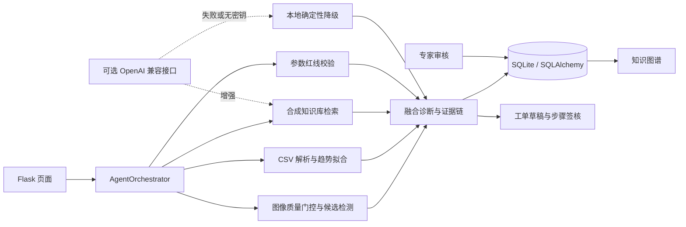

# 系统架构

## 数据流

## 关键设计

1. **工具编排而非黑盒调用**：Agent 将图片、传感器、检索、红线、诊断和工单拆成可观察步骤，每一步记录状态、耗时和摘要。
2. **本地优先**：没有云端密钥时，使用合成知识库和确定性规则；网络请求失败时回退到相同的本地路径。
3. **证据可追溯**：诊断结果关联 trace id、检索来源、匹配词、传感器数据质量回执和红线结果。
4. **业务闭环**：诊断或预测分析可以生成工单，工单步骤签核后再沉淀为可审核案例。
5. **部署边界清晰**：Render 配置用于演示；生产场景仍需认证、权限、CSRF、持久化数据库和审计能力。

## 模块边界

| 模块 | 输入 | 输出 |
| --- | --- | --- |
| `image_service.py` | JPG/PNG/WebP/BMP | 质量分、候选区域、风险特征、分析叠加图 |
| `predictive_service.py` | `hour,temperature,vibration,pressure` CSV | 数据质量、趋势斜率、健康度、维护窗口 |
| `vector_service.py` | 文本现象和多模态摘要 | 匹配证据、命中词、离线诊断建议 |
| `standards_service.py` | 规则键和值 | 合格/超差、偏差量、解释消息 |
| `agent_service.py` | 文本、图片、CSV、设备型号 | 六步轨迹、融合诊断、工单草稿 |
